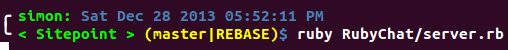
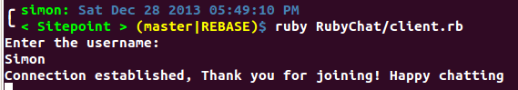
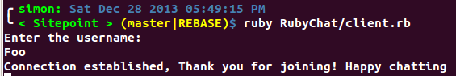
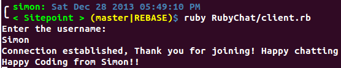
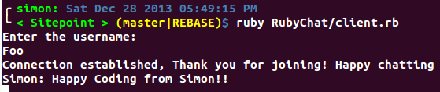
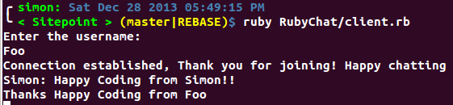
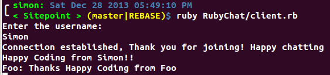
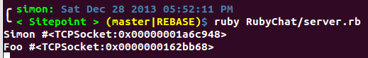

# TCP Ruby Chat
Today, we are going to build a little TCP ruby chat application using the ruby standard library Socket, I'm using ruby 2.0.0, and Ubuntu Linux 12.04LTS, but it should work on Mac OS too. I haven't tried it on Windows.

First a short overview of TCP (Transmission Control Protocol):

> TCP is one of the core protocols of the Internet protocol suite (IP), and is so common that the entire suite is often called TCP/IP. Web browsers use TCP when they connect to servers on the World Wide Web, and it is used to deliver email and transfer files from one location to another. For more detaled information visit [TCP Wikipedia](https://en.wikipedia.org/wiki/Transmission_Control_Protocol)

### This is how our TCP chat is going to work
> 

## Description
First, we will create a server that receives the client connections and stores them in data dictionaries.  These dictionaries will keep track of what room the client is located in, receive messages, and relay the messages to other users. Each user MUST have a different username, which will be our primary key to look at on our connections data dictionary so we can keep track of connected users. Right now, we aren’t going to store messages in a database, but it’s possible.
When we created the server the users should be created in different terminals, which means bash/command terminals, so each terminal means a different user to simulate multiple users and establish a conversation between them. (Look the pictures at the end)

First we are going to create the necessary files: 'server.rb' and 'client.rb'
In server.rb and client.rb we have to require the
> * [Socket library](http://www.ruby-doc.org/stdlib-2.0.0/libdoc/socket/rdoc/Socket.html)

```ruby
# in client.rb and server.rb
require "socket"
```

then create the respective classes with some attributes to handle users
The client receives a server instance so it can establish a connection with the server, then initialize a request and response to send and receive messages through the server. Right now our `@response` and `@request` objects are null, but later on we are going to build two threads and assign them to our objects to read and write at the same time.

```ruby
# in client.rb
require "socket"
class Client
  def initialize(server)
    @server = server
    @request = nil
    @response = nil
  end
end
```

If you want to know more on threads, check out:

* [Threads in Ruby](http://www.sitepoint.com/threads-ruby)
* [Ruby Threads](http://ruby-doc.org/core-2.0.0/Thread.html)
* [Ruby Multithreading](http://www.tutorialspoint.com/ruby/ruby_multithreading.htm)


Here's the start of our server.
The server receives a port which will be our channel for establishing a connection between users. The server listens to the port for any event and sends a response to everyone who is interested.  The initializer also creates three 3 hashes:

* `@connections` is a pool of users connected to server.
* `@rooms` is keyed on room name and holds the users in each room.
* `@clients` are our connected client instances

```ruby
# in server.rb
require "socket"
class Server
  def initialize(port, ip)
    @server = nil
    @connections  = {}
    @rooms = {}
    @clients = {}
  end
end
```

Now we can track which user is in which room.  It's important to not that the client name/username must be unique. Here is what our hashes will look like with some data

```ruby
# hash Connections preview
connections: {
  clients: { client_name: {attributes}, ... },
  rooms: { room_name: [clients_names], ... }
}
```

Then we need to create two threads on the client side so it can read/write messages at the same time. Without this functionality our chat would be very boring. Imagine typing your message and only after finishing being able to look for an answer without the posibility of doing both at the same time. This is how most chat clients work basically.

```ruby
# ( @request, @response ) objects preview and descriptions
# The request and response objects implementation may look like this

# in client.rb
@request = Thread.new do
  loop { # write as much as you want
    # read from the console
    # with the enter key, send the message to the server
  }
end

@response = Thread.new do
  loop { # listen for ever
    # listen the server responses
    # show them in the console
  }
end
```

Now we are going to build some methods to handle both listening and writing.

```ruby
# Actual implementation of (@request, @response ) objects inside their own methods

# in client.rb
def listen
  @response = Thread.new do
    loop {

    }
  end
end

def send
  @request = Thread.new do
    loop {

    }
  end
end
```

On the server side we need something similar, but we need one thread per connected user, so that we can handle as many users as possible without any concurrency issuesl.

```ruby
# in server.rb
def run
  loop {
    Thread.start do |client| # each client thread
    end
  }
end
```

The port MUST be the same on the client and server side and in this case the IP should be "localhost" which means "127.0.0.1"

>A port is not a physical device, but an abstraction to facilitate communication between a server and a client.  A machine can have a maximum of 65536 port numbers (ranging from 0 to 65535). The port numbers are divided into three ranges: the Well Known Ports, the Registered Ports, and the Dynamic and/or Private Ports. - [Brief Description of TCP and UDP](http://agenda.ictp.trieste.it/agenda_links/smr1335/networking/node28.html)


Later, we’ll implement how to receive messages to/from the server with the two methods `get` and `puts`. We’ll also clean up all of the extra characters at the end of a message, such as the end of the line, tabs, etc.
* `get`, used in `listen`, reads messages from the server
* `puts`, used in `send`,  writes messages to the server


```ruby
# client.rb( client side )
class Client
  # ask user name
  def initialize(server)
    ...
    listen #call listen method to create the response thread
    send #call send method to create the request thread
  end

  def listen
    loop {
      msg = @server.gets.chomp # gets the server message
      puts "#{msg}" # write the output to the user's shell
    }
  end

  def send
    loop {
      # $stdin means standard input (Shell input or Command input)
      msg = $stdin.gets.chomp # gets users input from command line
      @server.puts( msg ) # write all the user messages to the server
    }
  end
end
server = TCPSocket.open("localhost", 3000) # (ip, port) in each machine "localhost" = 127.0.0.1
Client.new(server)
```

On the server side, the implementation is quite simple. All we need is to finish up with the `run` method, and verify the uniqueness of the username provided. If  the username is taken, tell the client with an error message and kill the connection. Otherwise, give the client a successfull connection message.

```ruby
# server.rb ( server side )
class Server
  def  initialize(port,ip)
    @server = TCPServer.open(ip, port)
    ...
  end

  def run
    loop {
      # for each user connected and accepted by server, it will create a new thread object
      # and which pass the connected client as an instance to the block
      Thread.start(@server.accept) do | client |
        nick_name = client.gets.chomp.to_sym
        @connections[:clients].each do |other_name, other_client|
          if nick_name == other_name || client == other_client
            client.puts "This username already exist"
            Thread.kill self
          end
        end
        puts "#{nick_name} #{client}"
        @connections[:clients][nick_name] = client
        client.puts "Connection established, Thank you for joining! Happy chatting"
      end
    }
  end
end
server = Server.new("localhost", 3000) # (ip, port) in each machine "localhost" = 127.0.0.1
server.run

```

Right now our chat is almost finished, but there is one method left for handling all the messages between all connected users. Without it, our users won't be able to send messages to each other.

```ruby
# in server.rb
def listen_user_messages(username, client)
  loop {
    # get client messages
    msg = client.gets.chomp
    # send a broadcast message, a message for all connected users, but not to its self
    @connections[:clients].each do |other_name, other_client|
      unless other_name == username
        other_client.puts "#{username.to_s}: #{msg}"
      end
    end
  }
end
```
All the `listen_user_messages` method does is listen to the users messages and send them to all the other users. Now, call this method inside the `run` method in the server instance and that's it.

```ruby
# in server.rb
def run
  loop {
    Thread.start(@server.accept) do | client |
      ...
      listen_user_messages(nick_name, client)
    end
  }
end
```

This is our chat working on the terminal, in future articles we are going to build the users’ chat room along with How to send private messages and more cool stuff to customize our chat.

## Lets see our little chat
#### initialize server

#### initialize client Simon

#### initialize client Foo

#### Message from Simon to Foo

#### Message recieved From Simon

#### Message from Foo to Simon

#### Message recieved From Foo

#### Server-Client Connections


### Next steps
* [Tutorialspoint](http://www.tutorialspoint.com/ruby/ruby_socket_programming.htm)
* [TCP Sockets book](http://www.jstorimer.com/products/working-with-tcp-sockets)

## Happy Coding!
[Source Code](https://github.com/sescobb27/Sitepoint/tree/master/RubyChat)
