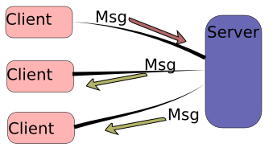
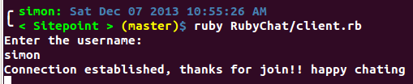
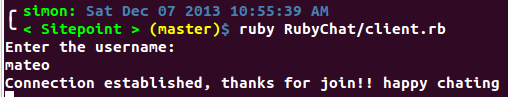
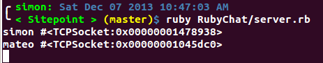
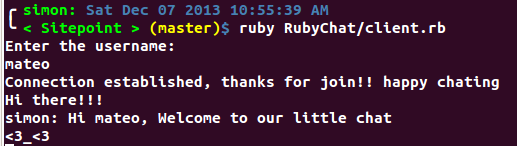

# TCP Ruby Chat
Hi, my name is Simon Escobar and we are going to build a little TCP ruby chat
using the ruby standard library Socket, I'm using ruby 2.0.0, and Ubuntu
Linux 12.04LTS, it should work on Mac OS too, but I’m not sure if it works in Windows.

First a short overview of what is TCP (Transmission Control Protocol):

> TCP is one of the core protocols of the Internet protocol suite (IP), and is so common that the entire suite is often called TCP/IP.

> Web browsers use TCP when they connect to servers on the World Wide Web, and it is used to deliver email and transfer files from one location to another.

> For more detaled information visit [TCP Wikipedia](https://en.wikipedia.org/wiki/Transmission_Control_Protocol)

### This is how our TCP chat is going to work
> 

First we are going to create the necessary files:
    'server.rb'
    'client.rb'

In server.rb and client.rb we have to require the
[Socket library](http://www.ruby-doc.org/stdlib-2.0.0/libdoc/socket/rdoc/Socket.html)
[Socket Server](http://www.ruby-doc.org/stdlib-2.0.0/libdoc/socket/rdoc/TCPServer.html)

```ruby
# in client.rb and server.rb
require "socket"
```
then create the respective classes with some attributes to handle users and
rooms

```ruby
# in client.rb
class Client
  def initialize server
    @server = server
    @request = nil
    @response = nil
  end
end

# in server.rb
class Server
  def initialize port, ip
    @server = nil
    @connections  = {}
    @rooms = {}
    @clients = {}
  end
end
```

The client receive a server instance so it can establish a connection with the server,
then initialize a request and response objects for send and receive messages.

The server receive a port which is our channel for establishing a connection between
users, so it can listen the port for any event and send a response to everyone who
is interested in. Also we create 3 hashes.
* Pool of users connected to server
* Rooms which can handle users and an array of rooms
* Clients which are the users instances

```ruby
# hash Connections preview
connections: {
  clients: { client_name: {attributes}, ... },
  rooms: { room_name: [clients_names], ... }
}
```
this way we can know which user is in which room, so the client name must be unique.

then we need to create two threads on client side so it can write/read messages at the same
time, without this functionality our chat would be a very boring and nasty chat

```ruby
# in client.rb
@request = Thread.new do
  loop { # write how much you want
    # read from the console
    # when enter, send the message to the server
  }
end

@response = Thread.new do
  loop { # listen for ever
    # listen the server responses
    # show them in the console
  }
end
```

now we are going to build some methods to handle both operations Listen and Write

```ruby
# in client.rb
def listen
  @response = Thread.new do
    loop {

    }
  end
end

def send
  @request = Thread.new do
    loop {

    }
  end
end
```

On server side we need something similar, but we need one thread per each user
connected to it, this way we can handle as much users as possible without any concurrency
problem.

```ruby
# in server.rb
def run
  loop {
    Thread.start do |client| # each client thread
    end
  }
end
```

lets get dirty coding TCP code, by the way the PORT MUST be the same
in the client side and server side, and in this case the IP should be "localhost"

> A port is not a physical device, but an abstraction to facilitate communication between a server and a client.
A machine can have a maximum of 65536 port numbers (ranging from 0 to 65535). The port numbers are divided into three ranges: the Well Known Ports, the Registered Ports, and the Dynamic and/or Private Ports.
> [Brief Description of TCP and UDP](http://agenda.ictp.trieste.it/agenda_links/smr1335/networking/node28.html)

```ruby
# client.rb( client side )
class Client
  ...
end
server = TCPSocket.open( "localhost", 3000 ) # ( ip, port ) in each machine "localhost" = 127.0.0.1
Client.new( server )

# ask user name
def initialize
  ...
  listen # call listen method to create the response thread
  send #call send method to create the request thread
end

def listen
  loop {
    msg = @server.gets.chomp # gets the server message
    puts "#{msg}"
  }
end

def send
  loop {
    msg = $stdin.gets.chomp # gets users input from commando line
    @server.puts( msg )
  }
end

```

in the server side

```ruby
# server.rb ( server side )

def  initialize
  @server = TCPServer.open( "localhost", 3000 ) # ( ip, port ) in each machine "localhost" = 127.0.0.1
  ...
end

def run
  loop {
    # for each user connected and accepted by server, it will create a new thread object
    # and which pass the connected client as an instance to the block
    Thread.start(@server.accept) do | client |
      nick_name = client.gets.chomp.to_sym
      @connections[:clients].each do |other_name, other_client|
        if nick_name == other_name || client == other_client
          client.puts "This username already exist"
          Thread.kill self
        end
      end
      puts "#{nick_name} #{client}"
      @connections[:clients][nick_name] = client
      client.puts "Connection established, thanks for join!! happy chating"
    end
  }
end
```

our chat is almost finished, but there is one method left for handling
all the messages between connected users

```ruby
# in server.rb
def listen_user_messages( username, client )
  loop {
    # get client messages
    msg = client.gets.chomp
    # send a broadcast message, a message for all connected users, but not to
    # its self
    @connections[:clients].each do |other_name, other_client|
      unless other_name == username
        other_client.puts "#{username.to_s}: #{msg}"
      end
    end
  }
end
```
now, call the method inside our run method in server class

```ruby
# in server.rb
def run
  loop {
    Thread.start(@server.accept) do | client |
      ...
      listen_user_messages( nick_name, client )
    end
  }
end
```

and there is our little chat, in future articles we are going to build the users chat room.

## Lets see our little chat






### Next steps
[Tutorialspoint](http://www.tutorialspoint.com/ruby/ruby_socket_programming.htm)
[TCP Sockets book](http://www.jstorimer.com/products/working-with-tcp-sockets)

### see you later
## Happy Coding
[Source Code](https://github.com/sescobb27/Sitepoint/tree/master/RubyChat)
